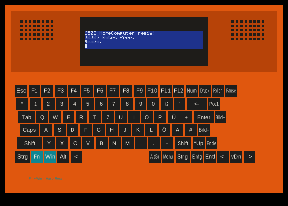

# MAME Replica of the HomeComputer 6502

Target hardware and memory map: see [../docs/system-spec.md](../docs/system-spec.md), keyboard matrix: [../docs/keyboard-matrix.md](../docs/keyboard-matrix.md). Assessment of MAME as an emulator: section 13.2 of the specification.

**Status (September 22, 2026): The driver fully boots the real firmware and shows the whole device – case, speaker and keyboard – with the real, live-running LCD embedded in it.**



The image is a real screenshot from `mamehomecomputer6502`: not just the bare screen signal, but the complete device as artwork (case, speaker grille, all 89 keys), with the **live-running** LCD screen composited exactly into the bezel cutout – MAME's built-in artwork/layout system makes this possible (section 3). It runs the original firmware built from `../../homecomputer-6502/firmware`: "6502 HomeComputer ready!", "30307 bytes free.", "Ready." and the blinking cursor, all four lines correctly stacked as on the real hardware.

## 1. Files in this folder

| File | Purpose |
|---|---|
| `src/homecomputer6502/homecomputer6502.cpp` | The actual driver (C++) |
| `src/layout/homecomputer6502.lay` | Artwork/layout: case, speaker, all 89 keys and the placement of the live screen in the LCD bezel (see section 3) |
| `src/homecomputer6502.lst` | Driver list (documentation, see section 11) |
| `scripts/target/mame/homecomputer6502.lua` | Minimal MAME subtarget that builds only our driver, its layout and its dependencies |
| `install.sh` | Copies the files above into a MAME source tree |
| `roms/homecomputer6502/hd44780u_a00.bin` | Character set ROM of the LCD controller, transcribed by ourselves from the datasheet (see section 5) |
| `tools/extract_hd44780_charset.py` | Script that generates this character set ROM from a page scan of the HD44780U datasheet (reproducible, see section 5) |
| `docs-assets/mame-full-device.png` | The screenshot shown above |
| `docs-assets/lcd-screenshot.png` | Older screenshot, bare LCD only without case artwork (for comparison) |

The MAME source tree itself does **not** belong in this repo (over 1 GB, third-party project). `install.sh` expects your own checkout of `mamedev/mame`.

## 2. Building and trying it out

```bash
git clone --depth 1 https://github.com/mamedev/mame.git /path/to/mame
./install.sh /path/to/mame
cd /path/to/mame
make SUBTARGET=homecomputer6502 -j$(nproc)
```

Build time on a 32-core machine with the system libraries already installed (SDL2, fontconfig, alsa-lib – all standard on most Linux distributions): **under 2 minutes** for the first, not yet cached run. That is much faster than a full MAME build, because the subtarget compiles only our ~10 devices and their direct dependencies instead of all several thousand MAME drivers.

After that, [`../scripts/run-mame.sh`](../scripts/run-mame.sh) (from the project root) is all you need. The script starts MAME and first rebuilds only what is out of date: the driver, if `mame-extensions/src` differs from the copy in the MAME checkout or `mamehomecomputer6502` is still missing, and the firmware from `src/`, if `make -q` there asks for a rebuild. If both are current, MAME starts immediately.

The MAME source tree lives in `mame/` in the project root (gitignored, not part of this repo). This project's driver sources live in `mame-extensions/`. `scripts/run-mame.sh` without arguments uses `mame/`. A different checkout can be passed as the first argument or via `MAME_DIR`.

```bash
scripts/run-mame.sh
# different checkout:
scripts/run-mame.sh /path/to/mame
MAME_DIR=/path/to/mame scripts/run-mame.sh
```

Additional arguments are passed straight through to MAME, e.g. `scripts/run-mame.sh -video none -sound none -seconds_to_run 5`. By default the ACIA is attached to a host PTY (`-rs232 pty`); the path is printed to the console at startup as `ACIA serial PTY: /dev/pts/N`. Connect PicoCom to it:

```bash
picocom --b 19200 --imap lfcrlf --omap crlf --echo /dev/pts/N
```

The firmware is 19200 8N1. For that, use `tools/terminal/mame-pico.sh` on the PTY and `tools/terminal/serial-pico.sh` on real hardware (`/dev/ttyUSB0`). The PTY card in MAME samples the line itself and does not follow the 6551's control register; the driver sets it to 19200. Picocom's baud rate on the Linux PTY changes nothing about that. Alternative: `-rs232 null_modem` (bitbanger in the MAME UI, file or socket). To empty the slot: `-rs232 ""`. `install.sh` trims `default_rs232_devices` in MAME's `rs232.cpp` down to the same two cards, otherwise linking the mini subtarget fails.

By default the script starts in a **window** (`-window`), not fullscreen – fullscreen proved unreliable for input focus (see below). Pass `-nowindow` as an additional argument to override this.

**Keyboard under Wayland:** The script sets `SDL_VIDEODRIVER=x11` unless it is already set otherwise. Reason: under a Wayland desktop, SDL2 picks its native Wayland backend by default, and in tests **no** keyboard input at all reached the emulation – not even with a correctly focused window. Verified with real, synthetically generated X11 key presses (`xdotool`) plus a temporary log output directly in the driver (`via2_pa_r()`): with the `x11` backend forced, the pressed key reliably arrived in the simulated keyboard pattern; with the native Wayland backend, never. If it still doesn't work for you, set `SDL_VIDEODRIVER=x11` yourself before the call (or try another value such as `wayland` for testing – the script keeps an already-set environment variable and does not overwrite it).

**If keyboard input still doesn't arrive:** Two common causes. First, the MAME window needs input focus like any other window – actually click into it (not just Alt-Tab to it; under X11, SDL's input focus only reacts here once the mouse pointer has really entered the window). Second, the **Scroll Lock** key by default toggles between the emulated keyboard and MAME's own control menu; if it is set to "menu", no input reaches the emulated computer. Press Scroll Lock once to switch back.

To run manually, two files are expected in the ROM path, in a subfolder `homecomputer6502/`:

- `firmware.bin` – the 32 KB ROM image from `src/` (`make` in `src/`, `CC65_HOME=/opt/cc65`). `scripts/run-mame.sh` places it here.
- `hd44780u_a00.bin` – from this folder, `roms/homecomputer6502/hd44780u_a00.bin` (see section 5)

```bash
./mamehomecomputer6502 -rompath <folder with the two files> homecomputer6502 -video soft -sound none -seconds_to_run 5
```

A screenshot can be produced automatically with an autoboot Lua script (handy for tests without a display):

```bash
cat > snap.lua <<'EOF'
local done = false
emu.register_periodic(function()
  local m = manager.machine
  if not done and m.time.seconds >= 2 then
    done = true
    m.video:snapshot()
  end
end)
EOF
./mamehomecomputer6502 -rompath <rom folder> homecomputer6502 -video soft -sound none \
  -seconds_to_run 4 -snapshot_directory snap -autoboot_script snap.lua
```

(`m.video:snapshot()` with a **colon**, not a dot – MAME's Lua bindings are class-based methods.)

## 3. Case artwork with live embedded screen

By default a MAME driver shows only the bare screen signal in an empty window (that is what it looked like before, see `docs-assets/lcd-screenshot.png`). But MAME has a built-in **artwork/layout system** for this: a `.lay` XML file can define background graphics (case, keyboard, …) and place the `<screen>` (the real, live-running emulated screen) at a specific spot within them – like a bezel around a calculator or organizer display in many other MAME drivers.

**Implementation:**

1. `src/layout/homecomputer6502.lay` defines three elements made of pure vector primitives (`<rect>`/`<text>`, no external image files needed): the case (outline + recessed top + LCD bezel), the two speaker grilles (generated via `<repeat>`/`<param>` as a 5×8 dot grid) and the complete 89-key keyboard – the latter generated with the same approach as the technical block diagram of the device (published separately as an artifact, not part of this repo) (a Python script computes all key positions from the physical layout in `docs/keyboard-matrix.md`, no manual work).
2. The `<view>` block places these elements and, between them, a `<screen index="0">` with bounds exactly in the cutout of the LCD bezel (`x="330" y="121" width="460" height="69"`) – MAME renders the real, live-running screen content into it, not an image of it.
3. Build integration: `custombuildtask { layoutbuildtask("mame/layout", "homecomputer6502") }` in the subtarget (`scripts/target/mame/homecomputer6502.lua`) automatically compiles the `.lay` into a generated header at build time; the driver includes it with `#include "homecomputer6502.lh"` and activates it with `config.set_default_layout(layout_homecomputer6502);`.

**A pitfall, found and fixed:** MAME normalizes every `<element>` to the actual bounding box of its child elements and then scales that proportionally to the bounds given in the `<view>`. An element whose content (e.g. just a small hint text) covers a much smaller area than the full canvas was therefore stretched massively out of shape when placed. Fix: first insert an invisible `<rect>` with `alpha="0"` covering the full 1120×800 canvas into every element, so that the bounding box is the same in every element and the view placement maps 1:1 instead of stretching.

## 4. Existing MAME devices for our components

All chips of this system exist as ready-made, reusable MAME devices. No chip had to be newly emulated, only a new system interconnection (the driver).

| Component | MAME device | Source file |
|---|---|---|
| 6502 CPU | `M6502` | `src/devices/cpu/m6502/m6502.h` |
| 6522 VIA (×2) | `MOS6522` (`via6522_device`) | `src/devices/machine/6522via.cpp` / `.h` |
| R6551 ACIA | `mos6551_device` (`MOS6551`) | `src/devices/machine/mos6551.cpp` / `.h` |
| SID 8580 | `mos8580_device` (`MOS8580`) | `src/devices/sound/mos6581.cpp` / `.h` (matches our confirmed 8580, see system-spec.md section 5.4) |
| HD44780U LCD controller (×2) | `hd44780u_device` (`HD44780U`) | `src/devices/video/hd44780.cpp` / `.h` |
| Wired-OR IRQ | `INPUT_MERGER_ANY_HIGH` | `src/devices/machine/input_merger.cpp` / `.h` |

The address decoding in the driver (`mem_map()`) corresponds 1:1 to the memory map from system-spec.md section 2/2.1: RAM `$0000–$7EFF`, ACIA `$7F00`, VIA1 `$7F20`, VIA2 `$7F40`, SID `$7F60`, ROM `$8000–$FFFF`.

## 5. hd44780u_a00.bin (character set ROM)

MAME's `hd44780u_device` strictly requires a 4 KB character set ROM. MAME's Git repo contains **no binary file** for it, only a checksum in the source code (`src/devices/video/hd44780.cpp`), itself marked `BAD_DUMP` – according to the comment there it was "typed in from page 17 of the 1999 HD44780U datasheet", so it is itself already a transcription, not a silicon dump.

I independently made the same transcription, directly from the primary source:

1. Datasheet PDF obtained from the MIT-licensed repository [rm-hull/luma.lcd](https://github.com/rm-hull/luma.lcd) (`doc/tech-spec/HD44780.pdf`, a copy of the public Hitachi datasheet).
2. Page 17 ("Table 4, Correspondence between Character Codes and Character Patterns, ROM Code: A00") rendered at 400 dpi.
3. The table grid lines and the 5×8 dot grid of each cell were **detected programmatically** (not counted by hand) and evaluated for all 256 character codes. The script for this is at [`tools/extract_hd44780_charset.py`](tools/extract_hd44780_charset.py) and is reproducible (the exact source and procedure are documented there too).
4. The result was **visually compared with the original table** (target/actual side-by-side of all 256 characters as a rendered image) and the only deviations (isolated stray pixels in the columns 0x00–0x1F reserved for CGRAM, which are empty in the datasheet) were corrected.
5. Tested with the **real firmware in the emulator** – see the screenshot above, the text is perfectly readable.

Result: `crc32 f9cafd2a`, `sha1 4497380091e9d249ae907d64084094a68602e8eb`. This is deliberately not MAME's own `BAD_DUMP` hash. `install.sh` enters this hash in `src/devices/video/hd44780.cpp` and removes `BAD_DUMP`, otherwise the file remains a "wrong" ROM and MAME stops at startup with the red warning.

The driver deliberately uses `HD44780U` (not the older `HD44780`), because our transcription comes from the 1999 datasheet, not the older 1985 one.

## 6. Two firmware hangs found and fixed

Until the screenshot above was produced, the firmware twice got stuck in wait loops before it even reached text output. Both causes were incomplete configuration of the MAME ACIA (`mos6551_device`), not the firmware itself:

1. **`m_acia->set_xtal(...)` was missing.** The `clock` constructor parameter of `MOS6551(config, m_acia, 1.8432_MHz_XTAL)` does **not** automatically set the internal baud rate generator (`m_xtal` otherwise stays 0). Without a separate `set_xtal()` call the internal transmit clock never starts, the TDRE bit ("Transmit Data Register Empty") is never set again after the very first byte sent, and `acia_putc()`'s wait loop on `ACIA_STATUS_TX_EMPTY` hangs forever. Found via CPU trace (`trace` debugger command), which showed the CPU in an endless loop at `lda $7f01 / and #$10 / beq ...` – exactly the wait loop from `acia.s65`.
2. **`/CTS` was not wired.** On the real hardware, `/CTS`, `/DSR`, `/DCD` are tied permanently to GND (system-spec.md section 5.1). But MAME's `mos6551_device` initializes `m_cts` as "not active", and according to the source code the internal transmitter state machine only starts `if (!m_cts && ...)`. Without an explicit `m_acia->write_cts(0)` (plus `write_dsr(0)`, `write_dcd(0)`) the transmitter stays idle forever, even with a correct clock. Found by briefly enabling MAME's own `VERBOSE` logging in `mos6551.cpp` and tracing the `update_divider()` calculation.

Both fixes are documented as comments in the driver (`homecomputer6502.cpp`, `machine_start()` and `homecomputer6502()` respectively).

## 7. Composite 4×40 image

The two `hd44780u_device` instances each have their own internal `render()` method, which fills a buffer with one byte per dot row and character position (bit 4 = leftmost dot, see the comment above `screen_update_lcd()` in the driver). Instead of drawing each controller on its own screen, there is now a single `screen_update_lcd()` function in the driver that reads out both buffers itself and writes them pixel-exactly into **one** 240×36 image: controller 1 (lines 0/1) on top, controller 2 (lines 2/3) below – exactly as on the real hardware, where E1 addresses the upper two and E2 the lower two lines of the physical 4×40 display (system-spec.md section 5.5). Only one `SCREEN` device and one shared palette (`PALETTE_MONOCHROME_INVERTED`) remain in the driver, no more two debug screens.

## 8. What the driver can do now

- CPU, RAM, ROM (real firmware image), both VIAs, ACIA (internal clock, CTS/DSR/DCD on GND, TXD/RXD on the RS232 slot with default `pty`), SID are wired up and run through the complete firmware initialization without errors.
- LCD: two `hd44780u_device` instances that share the data lines (VIA1 PA0–3) and the RS line (PA4) but have separate enable lines (PA5 → controller 1 = lines 0/1, PA6 → controller 2 = lines 2/3) – exactly as on the real hardware (system-spec.md section 5.5). Driven pin-accurately (`db_w`, `rs_w`, `rw_w`, `e_w`), not via a command shortcut. Both are composed into **one** 4×40 image (see section 7) and show readable text with the real character set ROM.
- Keyboard matrix: VIA2 port B (rows 0–7) and VIA1 port B (rows 8–13, bits 0–5 only) select the row, VIA2 port A reads the columns. **All 87 keys** from [../docs/keyboard-matrix.md](../docs/keyboard-matrix.md) are now entered in `INPUT_PORTS_START` (checked key by key against the scancode table there; this uncovered a missing mapping – "Right Ctrl", scancode 110, row 13/column 6, was wrongly sitting in an "unused" bitmask – and it was fixed). `mame -valid` confirms no overlapping bit assignments.
- IRQ: VIA1, VIA2 and ACIA hang on a shared `INPUT_MERGER_ANY_HIGH` (wired-OR, system-spec.md section 6.1), as on the real board – confirmed by the regular 100 Hz tick in the CPU trace.
- Fn+Windows key → hard reset: dedicated input port `RESET` (outside the 14×8 scan matrix, as on the real hardware, system-spec.md section 5.6/7), evaluated via `PORT_CHANGED_MEMBER`/`INPUT_CHANGED_MEMBER` and `machine().schedule_soft_reset()` when both keys are pressed at the same time (see section 9).

## 9. Fn+Windows key as hard reset

The two keys are not part of the 14×8 scan matrix (so the firmware cannot query them) and instead, as on the real board, trigger a reset of the entire system directly. Modeled as a dedicated `PORT_START("RESET")` with two bits, each bound with `PORT_CHANGED_MEMBER` to the same handler `fn_win_reset()`: the handler fires on every change of either bit, but always reads the whole port and calls `machine().schedule_soft_reset()` only if **both** bits are currently set – this matches the real reset circuit that CPU, VIA1, VIA2, ACIA and SID share (system-spec.md section 7).

"Fn" has no PC key code of its own (laptop Fn keys are not reported as a separate key-down event by most operating systems), so here it is mapped to the right Windows key (`KEYCODE_RWIN`); the real Windows key is on the left one (`KEYCODE_LWIN`). Both are commented in the driver.

Tested with a Lua autoboot script that sets the two `ioport_field`s programmatically (`port:field(mask):set_value(1)`), evaluated with `-log`:
- Both keys at the same time → `error.log` shows **two** "Soft reset" entries (boot + triggered reset).
- Only one of the two keys (tested one after the other) → **one** entry, no additional reset.

## 10. Known gaps

1. **LED (VIA1 PA7)** is decoded but not displayed anywhere (no output/artwork).
2. **`firmware.bin` has no fixed checksum.** `machine_start()` reads it from `rompath/homecomputer6502/`. A `ROM_LOAD` hash would be outdated after every firmware build and would bring back the same startup warning.

## 11. Corrections to the original assessment

During the actual build attempt, two earlier assumptions in this document turned out to be wrong:

- **No entry in a global `src/mame/mame.lst` needed.** A dedicated subtarget with its own `createProjects_mame_<name>` function (like `homecomputer6502.lua` here) lists its files directly via `files{}`; MAME's build system (`genie.lua`) recognizes the subtarget script automatically by name (`scripts/target/mame/<SUBTARGET>.lua`) and needs no entry in the big driver list. The `.lst` file is not evaluated for this build path, but is still useful as documentation/for other tools and is therefore present anyway.
- **Build time was much shorter than feared** (under 2 minutes instead of the originally assumed 10 minutes to over an hour) – thanks to the subtarget mechanism and 32 cores. A *full* MAME build (`SUBTARGET=mame`, all several thousand drivers) would still take far longer; we haven't tried it and don't need it.

## 12. Next steps (proposal)

1. Make the LED (VIA1 PA7) visible as output/artwork.
2. Debug aids (CPU trace, `VERBOSE` logging of individual devices, Lua autoboot scripts for setting input ports and evaluating `error.log`) were very effective while debugging – worth keeping in mind as the standard approach for future driver changes.
